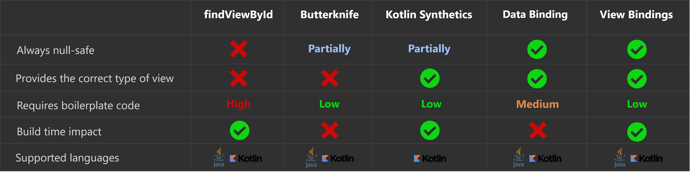

# Вместо вступления

Сейчас все перешли на [Jetpack](https://developer.android.com/jetpack), так вот, я говорю, что все перешли на [AndroidX](https://developer.android.com/jetpack/androidx)\). Из очевидного это изменение имен пакетов классов с `android.support` на `androidx`. 

В Jetpack входит много библиотек для разных задач, это и работа с бд, и камера, и прочее. Если требуется функционал, который реализован здесь, то можно закончить этим поиск \(за редким исключением мб\).

Касаемо биндинга разметки, по-прежнему можно использовать [ButterKnife](https://github.com/JakeWharton/butterknife), но я бы советовал View Binding \(недавно появилось\). На Kotlin есть удобный synthetics, который импортирует идетификаторы виджетов через пакеты, по которым можно получать сразу же их инстансы. Data Binding давняя вещь, я бы не сказал, что она прижилась \(кому-то может и заходит\), она позволяет интегрировать код прям в разметку. Но точно лучше не использовать древний `findViewById`.

Есть еще [Jetpack Compose](https://developer.android.com/jetpack/compose), это новый подход к разметке, но он еще в alpha. Даже в android studio версии stable пока еще недоступен. Там координальные отличия, я бы пока не советовал его использовать.

Касаемо темы приложения еще, можно использовать либо `AppCompat`, либо `MaterialComponents` семейство. Первый исключает набор виджетов [Material Design](coordinatorlayout.md). Если нужна поддержка темной темы, то однозначно `DayNight` 

Я бы советовал делать разметку в xml. Есть варианты реализации в коде, но они пока не стоят того. Касаемо вопроса о поддержке разных экранов, то есть старый дедовский способ, это использование `dimens` для проблемных виджетов. Пока другого нормального ничего не придумали\). Бывает еще, что разметка альбомной ориентации координально отличается от портретной, тогда проще сделать отдельную разметку в папке `layout-land` с тем же именем файла.

