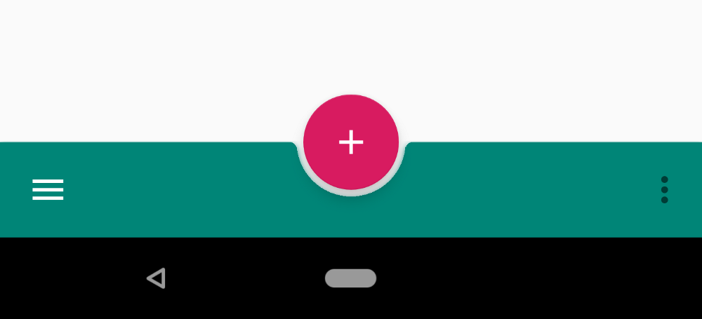

# Material Design

Для всего набора виджетов достаточно одной зависимости:

```text
dependencies {
    implementation 'com.google.android.material:material:1.2.1'
}
```

#### CoordinatorLayout

Наследуется от `FrameLayout`. Виджет впринципе создавался для анимаций. Наверное, встречал в приложениях, когда при скроллинге плавно скрывается/показывается toolbar \(гуглить `CollapsingToolbar`\) или fab кнопка, это тот случай. Т.е. есть уже готовые наборы анимации от google \(напр. `SwipeDismissBehavior`\), но можно создавать и свои через behavior.

#### DrawerLayout

Идет на пару с `NavigationView`, но необязательно. Это всем знакомая, выезжающая панелька слева \(можно и справа\).

#### SlidingPaneLayout

Это разновидность `DrawerLayout`, тот случай, когда нужно сдвигать основной экран, а не перекрывать при открытии виджета. Может понадобится, давным-давно юзал такое [решение](https://github.com/jfeinstein10/SlidingMenu), но как всегда лучше гугловское.

#### AppBarLayout

Это просто обертка над `Toolbar`. Этот виджет подтягивает основной цвет прилы из темы самостоятельно, добавляет тень под toolbar \(без него тени не будет, если только не использовать аттрибут`android:elevation`, но это не точно, который вдобавок потребует мин sdk 21\).

#### BottomNavigationView

Это нижний бар с меню \(обычно иконками\), как у вк или badoo, например.

#### BottomAppBar

Это нижний бар вместе с fab. По-моему, что-то похожее есть у toolbar, но надо гуглить



#### CardView

Отдельная зависимость:

```text
dependencies {
    implementation 'androidx.cardview:cardview:1.0.0'
}
```

Это карточка. Наследует `FrameLayout`. Может содержать только один элемент, ровно как и `ScrollView`, например.

#### FloatingActionButton

Это как раз та самая круглая кнопка с плюсом выше

